# Blockchain A-Z

[유데미 강의](https://www.udemy.com/course/best-blockchain-az/) 를 듣고 정리, 실습한 자료들입니다.

## Part1. 블록체인

## 1. 블록체인 직관적 이해

### Plan of Attack

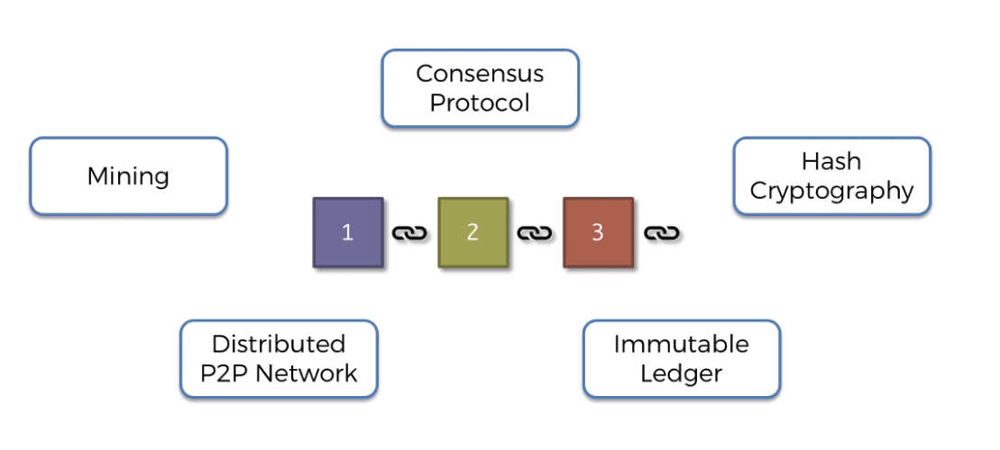

- 블록체인 개요
- SHA256 해시 알고리즘 이해하기
- 일반원장과 비교한 블록체인 장점 첫번째 보안 계층 → Immutable Ledger
- 분산P2P 네트워크 - 블록체인 원장 배포를 통해 두번째 보안계층의 신뢰성을 높일 수 있다.
- 채굴
- 암호화 퍼즐
- 비잔틴 내결함성 Byzantine Fault Tolerance
- 합의 프로토콜: Consensus Protocol → 공격자로부터 블록체인을 보호
- 합의 프로토콜 → competing chains
 
 

## 2. 블록체인은 어디서 왔나?

Stuart Haber

W.Scott Stornetta

지속적으로 증가하는 데이터, 즉 블록이라고 불리는 이 데이터를 암호학을 통해 보호하고 연결하는 기술이라고 정의합니다.

블록은 레코드이기 때문에 데이터를 가지고 있습니다.

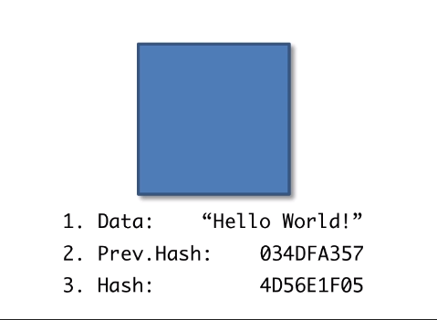

해시는 블록의 지문과 같습니다.

블록은 고유의 해시값을 가집니다.

Prev.Hash는 해당 해시의 바로 앞에 있던 블록의 해시값입니다.

블록1 → 첫번째 블록을 제네시스 블록이라고 합니다. 블록체인이 초기화된 후 이 블록은 언제나 첫번째 이기 때문에 제네시스 블록이라고 부릅니다. 절대로 바뀌는 경우가 벗습니다.

이전 해시가 없는 유일한 블록입니다.

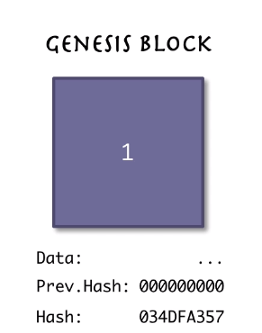

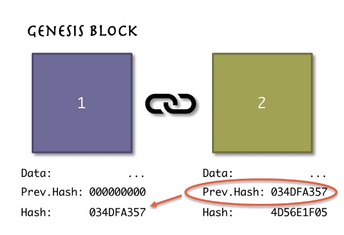

블록2의 Prev.Hash가 genesis block의 hash와 연결된 모습을 확인 할 수 있습니다.

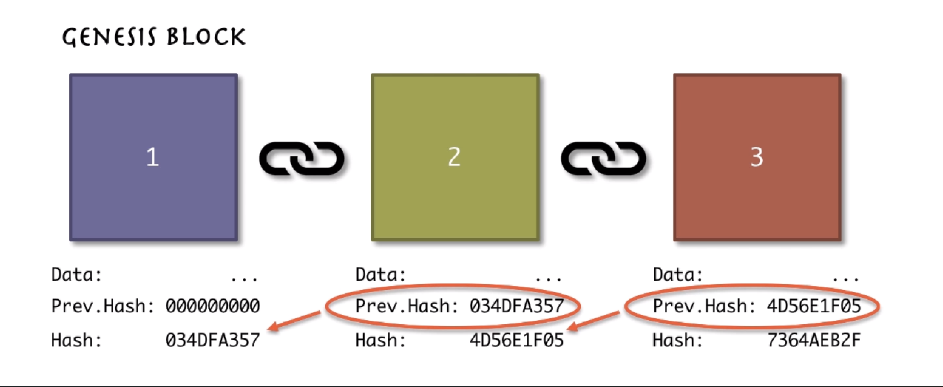

블록들이 암호로 연결되었다고 말하는 이유입니다.

<aside>
💡 Blocks are cryptographically linked together

</aside>
 
 

  

## 3. 블록체인의 특징

### SHA256 Hash

 

NSA에서 고안 매우 안전함

완전히 공유되어있음.

SHA는 안전한 해시 알고리즘의 약자이며 256은 메모리를 차지하는 비트 수 입니다.

해시의 길이는 언제나 64자이고, 숫자뿐아니라 문자도 올 수 있습니다. 즉, 해시의 문자는 각각 4비트를 가지고 있습니다.

어떤 디지털 문서에도 적용할 수 있습니다. 비디오, 텍스트, 오디오, 실행 파일 무엇을 적용하든 지문인 SHA256을 가질 수 있습니다.

같은 데이터를 입력하면 언제나 같은 해시값을 가지게 됩니다.

만약 아주 작은 심볼을 변경하면 해시값은 완전히 달라집니다. → 쇄도 효과

아무리 긴 내용을 입력해도 동일하게 64자의 해시 값이 할당됩니다.

유용하게 사용하려면 몇가지 사항을 충족해야 합니다.

- 단방향 (One-Way) → 즉, 뒤로는 갈 수 없습니다. 해시를 바탕으로 문서를 복원하거나 역설계할 수 없습니다. 사람의 지문과 동일합니다.
- 결정적이어야 합니다. (Deterministic) → 동일한 문서를 해싱 알고리즘에 적용하면 똑같은 해시값을 얻어야 합니다.
- 빠른 연산속도 (Fast Computation)
- **The Avalanche Effect**
  - 아주 작은 변형을 가해도 해시 값은 완전히 달라집니다.
  - 쇄도효과로 불리는 이유는 알고리즘 작동방식에 있습니다. → 하나의 변화가 몇가지의 변화를 유발하고 그들이 더 많은 변화를 유발하고 이는 더 많은 변화를 유발합니다.
- 충돌 저항성 (Must withstand collisions)
  - 비둘기집의 원리처럼 공간보다 데이터가 많은 경우에 일어나는 충돌이 일어날 가능성이 현저히 작고, 이러한 충돌이 일어나도 인위적인 경우 알고리즘이 견뎌내야 한다는 의미 입니다.

### 불변원장

 
지금의 현실세계에서는 예를들어 주택을 매입하고 주택에 대한 소유권이 데이터베이스에 저장되는데 이는 오류가 많고 수정되기 아주 쉽습니다.

블록체인이 등장하게 됩니다. 주택을 구매하면 새로운 트랜잭션이 추가되고 체인에 있는 단일 블록의 변경은 불가능하기 때문에 외부로의 불건전한 데이터 변경이 불가능 합니다. -> 수정하고싶으면..?

부동산권리 증서뿐 아니라 다이아몬드에도 적용됩니다. 즉, 물리적이 자산의 추적이 가능합니다.

[블록체인 경제: 제도적 암호경제학에 대한 초보자 가이드](https://medium.com/cryptoeconomics-australia/the-blockchain-economy-a-beginners-guide-to-institutional-cryptoeconomics-64bf2f2beec4)

### 분산 P2P 네트워크

 

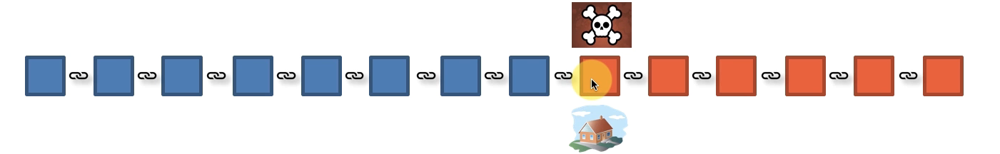

위와 같은 불변원장을 사용자의 접근을 제한하고, 시스템 오류가 발생했을 때 데이터를 복원하려면 어떻게 해야할까요?
바로 분산 P2P 네트워크로 해결할 수 있습니다.

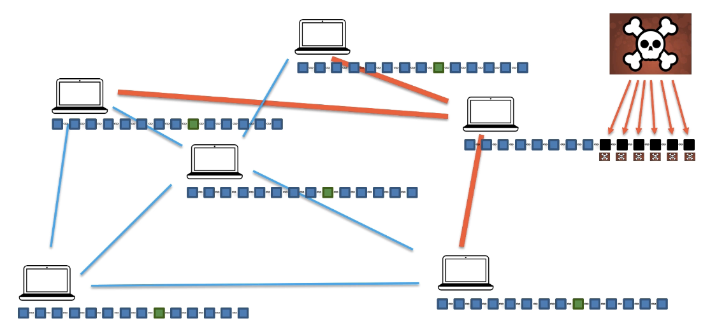

그런데 오른쪽 데스크탑의 체인을 보면 중간부분부터 해킹에 성공했고, 이후의 블록의 해시를 일일이 계산해 모두 다시 기록하고 변경에 성공했다고 가정했을 때, 거액의 피해가 발생할 것입니다.
하지만, 분산 P2P네크워크에서는 모두 끊임없이 동기화됩니다. 블록체인이 계속해서 피어가 일치하는지 확인합니다.
즉각적으로 피어가 일치하지 않는다면 해킹당했다는 것을 이해하게 될 것입니다. 그리고 자동적으로 연결되어있는 주변의 블록체인값을 가져와 다른 하나의 블록체인의 값을 기존 값으로 복사할 것입니다.
즉, 모든 블록체인을 공격해야 교체가 가능하게 됩니다.
또한 민감한 정보라도 일련의 값 즉, 해시로 저장되는 한 나의 컴퓨터에 있거나 다른 사람의 컴퓨터에 있거나 상관이 없습니다.
그렇게 신뢰가 없는 환경에 신뢰를 쌓게 됩니다.
해시가 1단계 보안이 되고 분산P2P네트워크가 2단계 보안, 합의프로토콜을 통해 블록체인을 강력하게 만드는 보안 층이 더 많아집니다.

## 4. 채굴(Mining)

### 채굴은 어떻게 작동하는가: 논스

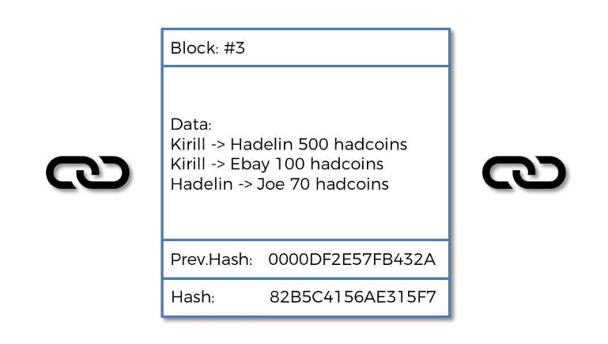

블록번호, 데이터, 이전해시를 해싱 알고리즘에 넣어서 해시를 도출해내는 과정은 간단한데 어째서 채굴은 복잡한 걸까?

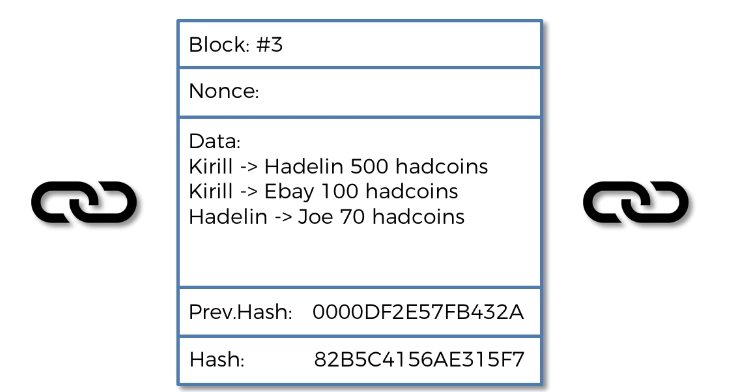

두번째 필드를 참고하면 해당 필드는 논스라고 불리는데 한 번만 사용되는 숫자를 뜻합니다. 바로 이 필드가 채굴에서 중요한 사항입니다.

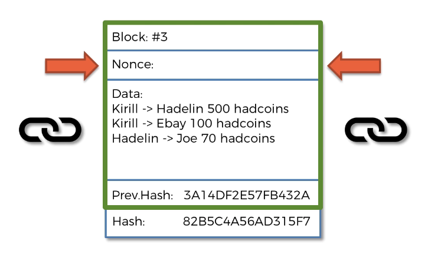

초록색의 박스부분이 해시를 제어하게 됩니다. 블록번호, 논스, 데이터, 이전 해시가 해당 부분입니다. 네가지 값을 해싱 알고리즘에 넣어 해시값을 도출해 낼 수 있습니다.
이제 논스로 하여금 추가적인 통제력과 유연성을 가질 수 있습니다. 블록 번호를 바꿀 필요없이 논스를 조정해서 해시값을 조정할 수 있습니다.
데이터는 바꿔서는 안되고(블록체인은 불변원장이기 때문에 기존값을 훼손해서는 안됩니다.)이전해시값도 바꿀 수 없습니다.
따라서 논스 값은 자유롭게 변경할 수 있으니, 해시값을 변경하거나, 조정 또는 다양하게 변화시킬 수 있는 것입니다.

### 채굴 작동 방식: 암호화 퍼즐

해시는 숫자입니다. 16진수로 10진수의 수에 A부터 F까지의 값을 추가로 갖습니다.

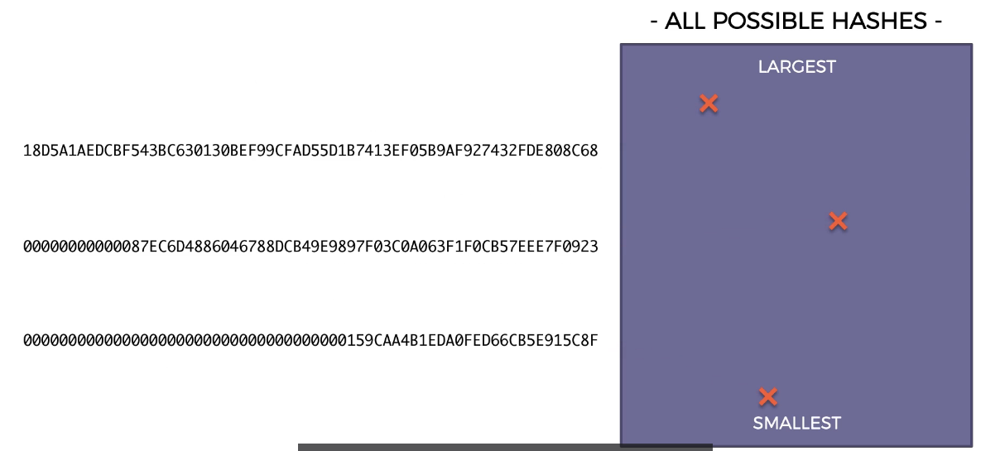

채굴은 기본적으로 채굴자들이 특정한 해시를 달성하도록 설정한 대상이 있습니다.
가능한 모든 해시를 사진과 같이 나타냈을 때, 길이별로 대상을 설정한 해시를 기준으로 줄여나가면서 연산해나가게 됩니다.
논스를 미세하게 조정하더라도 쇄도효과에 의해 해시값은 늘어나고 줄어드는 정도가 굉장히 커집니다. 이러한 특성으로 채굴이 쉽지 않도록 만듭니다.

## 5. 비잔틴 내결함성(Byzantine Fault Tolerance)

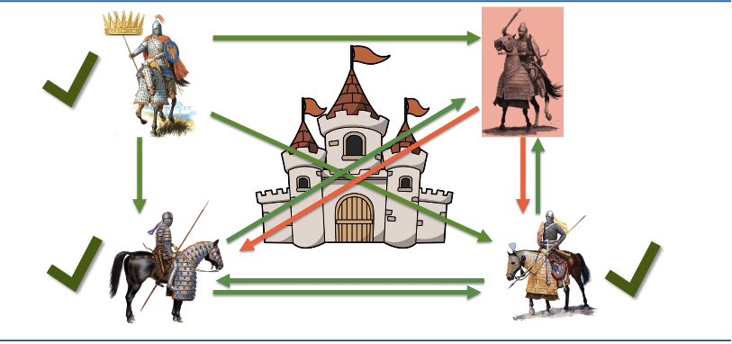

위와 같은 경우 한명의 반역자가 나오더라도 과반수의 의견에 따라 합의가 되므로 전체 결정에는 영향이 없습니다.

전달된 정보에 대한 다수결의 알고리즘으로 장군들은 전달된 정보에 기반해 의사결정을 내립니다. 이 알고리즘을 비잔틴 내결함성이라고 합니다.

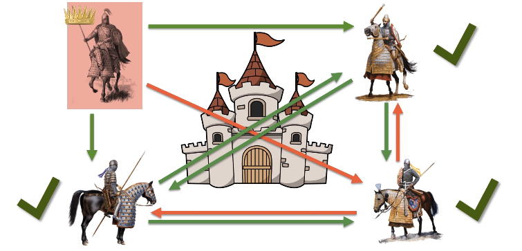

그런데, 위처럼 장군이 반역자인 경우에 같은 결정을 도출하는 경우는 세 장군중 하나의 장군에게만 다른 명령을 내리는 경우입니다.
따라, 내결함이 얼마인지를 우리가 알아야합니다.
논문에서는 3분의 1이상이 반역자일때는 작동할 수 없다고 말합니다. 이것이 바로 내결함성의 수준입니다.

이러한 논리를 블록체인에 적용시킨다면 반역자와 같이 시스템을 공격하는 자가 있을 수 있으니 합의 프로토콜이 있어야합니다. 그리고 최대한의 내결함성을 구현하려면 최대한 그 내결함성을 높인다는 것이 비잔틴 내결함성의 개념입니다.

## 6. 합의 프로토콜(Consensus Protocol)

### 합의 프로토콜 : 공격자에 대한 방어

